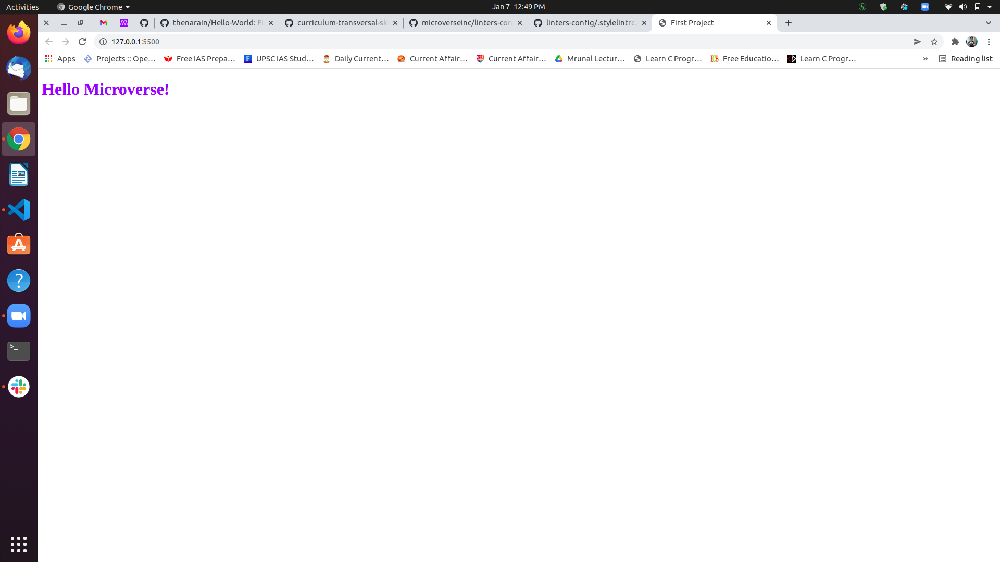

# Hello_Micoverse

> First project to get familliar with best practices and tools in software development.

## Built With

- HTML/CSS
- LINTER
- VSCODE

## Getting Started

To get a local copy up and running follow these simple example steps.

### Prerequisites

- Github
- IDE

### Setup

- git clone https://github.com/thenarain/helloWorld.git

## Authors

👤 **Kartikay Srivastava**

- GitHub: [@githubhandle](https://github.com/thenarain)
- Twitter: [@twitterhandle](https://twitter.com/TheNarainKartik)
- LinkedIn: [LinkedIn](https://www.linkedin.com/in/kartikay-srivastava/)

## 🤝 Contributing

Contributions, issues, and feature requests are welcome!

Feel free to check the [issues page](../../issues/).

## Show your support

Give a ⭐️ if you like this project!

## Acknowledgments

- Hat tip to anyone whose code was used
- Inspiration
- etc

## 📝 License

This project is [MIT](./MIT.md) licensed.
